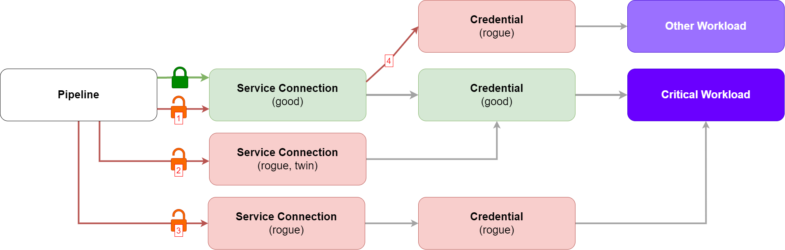

# CI/CD Resource Lifecycle - Identity Proxy

The first post in the series looks at [Pipelines and CI/CD Resources](https://ytimyno.github.io/blog/cicd/protected_resources). A pipeline boils down to a structured *set of instructions* and *its access to (CI/CD) resources*. Whereby these CI/CD Resources serve as a link to an underlying identity.

Previously, I proposed setting an outcome-focused goal. Shifting from "ensuring every pipeline is secure" to "ensuring the access to CI/CD Resources is done under the right conditions". This constitutes multiple steps:

1. Defining what are these *right conditions*;

2. Defining which CI/CD Resources are privileged;

3. Managing CI/CD Resources' lifecycle.

We will start addressing (3): Managing CI/CD Resources' lifecycle.

## Identity Proxy

To understand what a CI/CD Resource lifecycle solution could look like, including what it addresses and potential gaps, the *identity proxy* concept is useful.

Identities are unique and, by nature, cannot be stolen or shared. Credentials are our attempt to represent this uniqueness in the digital world. In this sense, credentials serve as an ***identity proxy*** - a way to turn a real-world identity into a usable digital format.

> *This section is inspired by [Identity-Native Infrastructure Access Management by Ev Kontsevoy, Sakshyam Shah, Peter Conrad](https://www.oreilly.com/library/view/identity-native-infrastructure-access/9781098131883/). The authors discuss how credentials challenge the true nature of identity. While an identity itself is immutable and non-transferable, credentials attempt to represent it as data - something that can be shared (and even spoofed). The book explores potential solutions for these challenges.* 

### Generic Identity Proxy Model

Introducing the concept of an identity proxy opens up a path that encourages us to look beyond platform-specific controls - I recognise my Azure DevOps bias! By doing so, we can develop a more **generic model**, offering long-term benefits and adaptability, rather than being [confined to ADO-specific approaches](#ado-identity-proxy-model).

This enables us to envision a platform-agnostic solution that meets our security and operational efficiency expectations.

In this case, the credential *is* the CI/CD Resource. I will nevertheless, continue with an ADO-specific analysis, as it allows for a quick(er) win.

### ADO Identity Proxy Model

Azure DevOps (ADO) natively segregates the pipeline from the CI/CD Resources (via service connections, agent pools, variable groups, secure files, etc). 

*ADO CI/CD Resources* (like those used in a pipeline) often stand as a secondary representation of a credential. And, as we've seen, *credentials* are considered an identity proxy.  

In Azure DevOps, CI/CD Resources come in various forms. Ultimately, each type serves as a proxy for a credential, thus, an indirect link to an identity.

  
<strong>Example: Azure DevOps CI/CD Resources as Proxies on Identity Proxies</strong>

     

<strong>1. Agent Pools</strong>:
Agents, where the CI/CD processes run, may have access to credentials (digital certificates, SSH keys, and other credential types). Access to an agent, a <strong>CI/CD Resource</strong>, means access to the <strong>credentials</strong> it has access to, resulting in access to the <strong>identities</strong> those credentials proxy. Authentication and authorisation to services is done based on those credentials.

<strong>2. Service Connections</strong>: Service connections allow pipelines to interact with external services by using stored credentials (like tokens or API keys). Access to a service connection, a <strong>CI/CD Resource</strong>, means access to the <strong>credentials</strong> it stores, resulting in access to the <strong>identities</strong> those credentials proxy. Authentication and authorisation to services is done based on those credentials.
 

<strong>3. Variable Groups</strong>: Variable groups hold sensitive values (e.g., passwords, keys) that pipelines use without direct access to the raw credentials. Access to a variable group, a <strong>CI/CD Resource</strong>, means access to the <strong>credentials</strong> it stores, resulting in access to the <strong>identities</strong> those credentials proxy. Authentication and authorisation to services is done based on those credentials.

<strong>4. Secure Files</strong>: Secure files, such as certificates or keys, are referenced in pipelines without exposing their contents. Access to a secure file, a <strong>CI/CD Resource</strong>, means access to the <strong>credentials</strong> it stores, resulting in access to the <strong>identities</strong> those credentials proxy. Authentication and authorisation to services is done based on those credentials.

<strong>5. Repositories</strong>: Repositories are not as straightforward. One scenario to imagine is, if a GitOps process uses a repository as a source of truth, it means there is an external process monitoring the contents of that repository. That external process may have its own access to ensure the state between the repository and the runtime is synced. In this scenario, access to the repository could be seen, indirectly, as providing access to credentials used by the external processes.

<strong>6. Environments</strong>: "An environment is a grouping of resources where the resources themselves represent actual deployment targets" - Accessing the environment grants access to service connections and secure files that have been configured to access those targets.
 

### Solution Threat Model (mini)

It's at the credential level that we can mediate access. However, each credential/proxy added to the solution is an additional element that can be misconfigured or exploited. Consider a scenario where a second (equivalent) credential is created and accessible to the pipeline, this could mean any conditions of access previously established are bypassed.

Moreover, looking at the Azure DevOps Identity Proxy Model, we can see the concern is multiplied. Imagine a scenario where:

- A critical workload is intended to be managed via CI/CD processes and automation.

- A service connection is created. This service connection stores the credentials to access the critical workload. 

- Access to the service connection is protected by a robust set of conditions, ensuring approvals are required before its use.

There are more questions we need to ask ourselves when adopting this model, more things we need to ensure are under control (diagram helps visualising these four questions):

1. Can someone update the service connection, removing the robust set of conditions applied?

2. Can someone create a rogue "twin" service connection, pointing at the same credentials, removing the robust set of conditions previously applied?

3. Can someone create a rogue service connection that points at rogue credentials, removing the robust set of conditions previously applied?

4. Can someone update the service connection to point at some other credential for some other identity?

#### Is the extra complexity in the ADO Identity Proxy Model a good thing?

As with any architecture that starts having too many arrows and dependencies, concerns start arising. Implementing a system that ensures consistent identity representation across all layers becomes increasingly difficult.

However, what is distinctive about this model is, it allows us to implement those conditions of access. In fact, ADO, by separating pipelines from CI/CD Resources, provides one of the most effective methods I've seen for mediating access. This separation allows for the application of conditions and access controls that are specifically based on the access needs themselves, leading to a more adaptable framework.

### Identity Proxy Conclusion

The best approach seems to be addressing identity as closely as possible, which is the idea behind the **Generic Identity Proxy Model**. Currently, I'm not aware of existing solutions that fully support this concept. Therefore, let's focus on what we can implement today while gathering insights that inform longer-term strategies.

## Lifecycle

> Before implementing lifecycle practices, it's essential to have clear definitions of the people, processes, and technology required to access a given CI/CD Resource. There are multiple challenges associated with identifying the right criteria for access and implementing it (which I plan to address on a later date, and [introduce here](#easier-said-than-done)).

### The Lifecycle of a CI/CD Resource

The lifecycle of a CI/CD Resource focuses on ensuring its protection is in line with expectations and policies. Effective management encompasses the entire lifecycle of the resource through creation, reading, updating, and deletion (CRUD), ensuring that:

- **Policy Application**: When a resource is created, a set of policies is applied to control access to the CI/CD Resource.

- **Access Control**: The expected entities (i.e.: pipeline) can read (or use) the resource if the defined policies are met.

- **Authorisation**: Creating, updating, reading, and deleting of resources is restricted to authorised entities, limiting what actions the entities may perform, including from where and when they can be performed.

- **Auditability**: Changes, access, creation, and deletion are auditable and guarantee non-repudiation.

- **Monitoring and Alerts**: Monitoring and alerts are established based on the criticality and sensitivity of the resource. Alerts are generated and addressed for unexpected actions on CI/CD Resources.

- **Stale Resource Management**: Stale resources are identified and deleted.

If using Azure DevOps, the high-level approach can be summarised as the continuous:

1. Define and review *what good looks like* by establishing the conditions under which resources should be accessed.

2. Discover and identify the most essential CI/CD Resources for your operations.

3. Apply the necessary approvals and checks (Azure DevOps protected resource conditions) that align with the conditions defined for the CI/CD Resources in scope.

## Disclaimers

### Identity Aware Proxies

I'm beginning to see the potential for extending and integrating this narrative beyond just CI/CD pipelines into other systems and platforms. This aligns with the concept of identity-aware proxies, where we can draw parallels to solutions like Google's Identity-Aware Proxy (IAP) and Microsoft Entra ID's Conditional Access. We've observed the introduction of [Conditional Access for workload identities](https://learn.microsoft.com/en-us/entra/identity/conditional-access/workload-identity), which suggests this could be a direction for us to explore. I plan to investigate this further, as it's a promising concept that resonates with me!

### Easier Said Than Done

Most organisations do not operate in a greenfield environment. Implementing certain checks may create ripples in existing processes. However, it's important to recognise that currently, your CI/CD resources may not be as protected as expected.

#### Implementing Policy: Which policies, approvals and checks should you use? And how?

Note there are multiple (ADO-native) ways to protect CI/CD Resources. However, certain protections may require heavy refactoring of existing processes (e.g., extending templates), which might not be desirable.

#### Crawl, Walk, Run: Stop the rot + Address legacy CI/CD Resources

You will probably need a deployment plan. It might look something like this, and it might happen in parallel with the policy definition.

0. Establish a rule whereby any new CI/CD Resources created must undergo the defined lifecycle process to ensure compliance with the policies and protections defined.

1. Start understanding your service connections, agent pools, and variable groups, including their purposes. This assessment will likely reveal overprivileged resources (related to the principle of least privilege and separation of duties). 

2. Identify the types of conditions and protections that best suit your CI/CD Resource environment, balancing benefits, complexity, and desired outcomes. Perhaps above all, the choice between options offered by ADO will largely depend on your organisation's maturity and agility for change.

## Next Challenge

Assuming *what good looks like* is defined in the context of using each *CI/CD resource you care about*, how can we ensure those policies are adhered to? We can use a combination of soft and hard controls, across People, Process and Technology. Can we make it easy for users to leverage the available toolkits and meet our expectations? How can we seamlessly integrate technology into processes, allowing people to focus on following them? 

## Conclusion

One of the key takeaways from our previous discussion is that access is important when managing pipelines. To transition from a focus on "ensuring every pipeline is secure" to "ensuring access to CI/CD Resources is granted under the right conditions", we must implement effective identity (or identity proxy) lifecycle management.

The concepts we've explored have allowed us to begin addressing how we can meet all the right conditions we've established, even in the absence of native approvals and checks. Though the solution proposed builds on Azure DevOps native concepts, it remains adaptable for future integration with strategic, vendor-neutral, solutions.

## References

- [Identity-Native Infrastructure Access Management by Ev Kontsevoy, Sakshyam Shah, Peter Conrad](https://www.oreilly.com/library/view/identity-native-infrastructure-access/9781098131883/)

- [Threat Modeling by Izar Tarandach, Matthew J. Coles](https://www.oreilly.com/library/view/threat-modeling/9781492056546/)