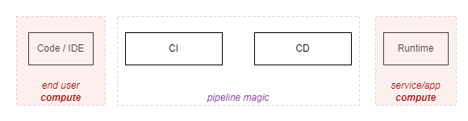
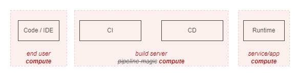
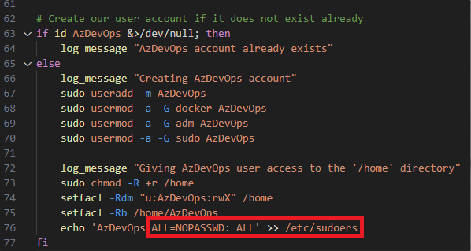

# CI/CD Execution Agents

There's more to a CI/CD platform than these [recipes we call "pipelines"](https://ytimyno.github.io/blog/protected_resources). These recipes are instruction sets that define workflows and which resources are accessed. But these workflows need to run somewhere.

CI/CD resources declared in pipelines can be source code repositories, files, pre-configured credentials or vaults, etc. There is a special kind of resource - *Execution Agents*, where the workflow is executed.

Mental Note 1: **Whether using private, cloud-hosted or SaaS-managed machines, there is no magic, the steps of a CI/CD workflow must be executed in some sort of compute**


## What does the work

Diagrams can sometimes oversimplify details that mask the workings of a system in not so obvious ways. I've fallen into this trap before. It's easy to accept the status quo which seems to follow the SDLC overarching model of Design -> Code -> Build -> Deploy -> Run.

Typical (classic) security controls, such as Endpoint Detection and Response (EDR), Data Loss Prevention (DLP), vulnerability scanning, etc, are largely applied to compute in the far ends of this process: User endpoints and running workloads. **It's easy to forget what goes on in between.**



We shall challenge this view!

### Pipelines are code execution "on the left"

Working with CI/CD pipelines for a while, we can start to see how a pipeline ***execution*** on a build agent should be treated as runtime, just like any other. With a few gotchas:

- Gotcha 1: Build and deploy environments have direct access to the environments you are deploying to
- Gotcha 2: Build and deploy environments are complex, with plenty of layers that make detection and attribution hard
- Gotcha 3: Build and deploy environments are less scrutenized and their criticality is often underestimated, compared to classic application or enterprise runtimes.



Here is how this combination of gotchas starts to make me twitch.

## Friendly Reminder

CI/CD workflow activities involve interacting with resources, artifacts, workloads, data, services. Authentication as an identity needs to happen, and you'll need to have the right authorization in place. 

> At some point, all the ***credentials that allow you to impersonate identities authorized to access resources will be accessible from the execution agent***. 

> There is no magic behind it. The secrets, the SSH private key files, the tokens, the 'secretless authentication' files required to access a target, will all be where they can be used to perform the sequence of instructions (steps) that have been passed onto the agent.

<!-- > In other words: When running a pipeline, that pipeline needs to access something. Therefore it needs credentials. -->

What makes this even more involved are the different identity layers:

- Pipeline identity
- Identities to access the CI/CD Platform (User/Service, whether local accounts, SaaS-managed or federated)
- Identities to access the target runtime workloads and services

Against different system components:

- CI/CD Platforms themselves (platform settings, resources hosted in the platform itself - i.e.: CI/CD platform settings around CI/CD resource and pipeline permissions and access control, such as repositories, credentials, execution agents)
- Execution environment (who can access the agent executing the workflow, with what level of privilege - i.e.: having direct access to the host running CI/CD workflows with superuser privileges)
- Runtime workloads (who/what can access the runtime workloads, how can they affect them, directly or indirectly - i.e.: the credentials used to access targets represent a specific level of privilege)

<!-- A picture is worth more than a thousand words. -->

Because identity is everywhere, this quickly escalates to an *"unmanageable mess"*. Ultimately, without access, you're limited in what you can do in the environment. Humans be humans, and ***overtime the tendency is to converge into the path of least resistence.***

> Now is probably a good time to do some introspection on how robust your CI/CD access management is, across users, service accounts and pipelines, against the different system components. Because it'll only get harder.

## Scenarios - Self-Hosted Agents in Azure DevOps

I played and recommend playing with self-hosted CI/CD execution agents to really grasp their power. If using Azure DevOps, the article [A Security Analysis of Azure DevOps Job Execution](https://www.cyberark.com/resources/threat-research-blog/a-security-analysis-of-azure-devops-job-execution) is detailed enough to understand the job execution worflow.

It's cool to play, but the *so what* question comes along. How would someone even get onto the machine, especially when in an organization that has multiple layers of defense. Direct access to the build agent is needed - ***or is it?*** (- that was sarcastic, it's not needed).

<div style="display: flex; justify-content: center;">
  <table>
    <thead>
      <tr>
        <th>Access Vectors</th>
        <th>Impact</th>
      </tr>
    </thead>
    <tbody>
      <tr>
        <td>Insider threat<br>Compromised user account<br>Malicious or vulnerable binary/package (supply chain)</td>
        <td>Data/secret exfiltration<br>Denial of Service/Wallet<br>Persistence/Lateral movement<br>Compromise of internal artefacts<br>Stop/tamper with security tooling</td>
      </tr>
    </tbody>
  </table>
</div>

Once you have access to the build agent through any of the access vectors above - chaos!

### Insider Threat or Insider Account Compromise

Knowing a the typical developer/engineer needs (and has) access to run CI/CD workflows, this gives them access to build servers (afents). In this scenario, there is a valid user account that can access a build agent. 

We are **not solely** speaking via the traditional SSH connection into the build server machine/VM. Rather, **access to the execution agent VM is a by-product** of scheduling a pipeline.

> "*Tasks run in an execution context, which is either the agent host or a container.*"

> [Microsoft Learn - target definition](https://learn.microsoft.com/en-us/azure/devops/pipelines/yaml-schema/target?view=azure-pipelines)

This YAML snippet is telling the Azure Pipelines service to run the job directly on the target host. It is the default mode.

```yaml
jobs:
- job: RunOnTargetHost
  steps:
  - script: echo "Running job on target host"
```

This YAML snippet is telling the Azure Pipelines service to run the job in a container on the host.

```yaml
jobs:
- job: RunOnTargetContainer
  container: python
  steps:
  - script: echo "Running in job container"
```

This YAML snippet is telling the Azure Pipelines service to run the job in a container on the host, with the second step targeting the host.

```yaml
jobs:
- job: RunOnTargetContainer
  container: python
  steps:
  - script: echo "Running in job container"
  - script: echo "Running job on target host"
    target: host
```

This means, if we want access to the execution agent host VM, all we need to do is *not* specify a container to run the job on or explicitly setting the target as being the *host*. Additionally, when running within a container, we're likely to be able to access the host via the Docker socket running in ```/var/run/docker.sock```.

> Ability to influence the pipeline configuration/definition means you can influence **what/where/when** it gets executed. And there are many ways to influence how a pipeline runs its course ([some more obvious than others](../technical/cicd/pipeline_influencer.md)).

Mental Note 2: **Access to the host is easily obtained (directly or indirectly)**

#### Theres more - $whoami

Guess what! Using "Virtual Machine Scale Set" option for you Azure DevOps build agent pool comes with default configuration scripts. And guess what users you get by default?

No, you're not root. That would go against basic Linux best practices! Instead, if you're following the standard set up, you will have an *AzDevOps* user account which happens to be able to *run any command as any user with sudo without being prompted for a password*.



Mental Note 3: **Likely the identity used to run the pipeline workflow process has superuser privileges on the execution agent**

> Do note this is easy to complain about, and harder to fix. We have to keep in mind security is not the end goal with this systems. That said, try to at least have compensating controls.

### Beyond Insider Threat and Compromised Accounts: Open Source Library Supply Chain Compromise Scenario

> Insider threats and compromised accounts aren't the only ways to get access to the build environment. 

The risks and complexities of running unvetted code - especially in the open-source world - are often overlooked or underestimated. There are consequences to blindly integrating external code into a system.

We've seen how there are escalation points allowing access to the underlying host with a super user, directly and indirectly:

- If runing a job directly on the build agent host 
- Even if running a container job, accessing the host indirectly (i.e: via the docker socket) 


Sometimes it is hard to articulate the *why should I care about this*. Consider this hypotethical scenario that shows how a trusted tool (CLI tool Checkov) being used in a pipeline with an unexpected extension of capability (command line argument/switch) that carries a *trojanised payload*. 

That is available here -> [From open source package to credential exfiltration from your build environment](https://ytimyno.github.io/blog/technical/exec_agents). It walks through the steps:

1. Creating a malicious Open Source "extra check" for Checkov 
2. (Assumes the user decides to use that extra check fuctionality as there is a GitHub page that looks good enough)
3. When the clitool is executed with the trojanised payload, it will silently attempt to exploit the host

Exploit shows:

- Pulling a 'malicious' packages from the outside
- Dumping environment variables (including the build service account 'temporary' access token)
- Zipping the working directory of the build agent and exfiltrating it (includes logs, built artefacts of every pipeline, from any project, that has being executed)
- Replacing the binary that controls the Azure DevOps build agent service with one that skips the secret redaction for future pipelines executed

Mental Note 4: **When executing *any* binary, trusted or untrusted, there is a risk you are running unintended code which will inherit the access your pipeline has**

### Sharing Templates (a GitHub Actions tale)

To exemplify this is really not just an Azure Devops thing, consider the same concepts in GitHub:

- ADO Build Agents ~= GitHub Runners (CI/CD execution agents)
- ADO Pipelines ~= Workflows (pipelines)
- ADO Jobs/Steps ~= Jobs/Actions (package of work scheduled in a runner)
- ADO Extensions ~= Marketplace GitHub Actions (ways to extend pipeline capabilities with ready made, pre-defined tasks)

GitHub Action templates are frequently shared (more frequent than with Azure DevOps pipeline templates or even Azure DevOps extensions, in my experience). This may be a by-product of the community around it and their simplicity. These actions and capability extensions should always be treated as untrusted unless proven otherwise (it's just more code written by someone else).

Mental Note 5: **There are many CI/CD Platforms enabling *good* users. Striving for more productive and usable workflows sometimes conflicts with the *security* of the environment and what gets built there**

### What if I use Microsoft-hosted agents?

Running the chance of getting my security badge revoked: I don't dislike Microsoft-hosted agents all the time. There are use cases for them. And I have gone as fair as saying "*Microsoft-hosted build agents are likely more 'secure' than inadequately managed self-hosted agents*".

> It's **hard** to manage build agents in a balanced (adequate) way - secure, cost-efficient and performant way.

Reasons to like Microsoft-Hosted:

- No management required (managed by MS)
- Each job runs on a fresh VM that gets destroyed by the end (harder to cross contaminate)
- Sits outside your infrastructure, reducing the likelihood of persistence/lateral movement
- Work great as a sandbox for untrusted code workflows 

Reasons not to like them:

- Significant DLP risk, and, because enterprise tooling (DLP/EDR) is not deployed, low or minimal observability over agents
- May not fit all use cases (specific builds, private network access to internal networks)
- Enterprise workflows may exceed MS license limits
- Inability to heavily monitor the agents

You may be able to bypass any DLP/networking controls by leveraging a combination of self-hosted agents + build artifacts + Microsoft build agents, in this order. 

Example: Use a self-hosted build agent to access a restricted resource in your environment with a pipeline execution, publish artefacts with data you were able to extract, and then use a Microsoft-hosted build agent to exfiltrate those pipeline artefacts.

## Impact

Depending on how the build agents are shared, their lifecycle and network restrictions applied, we can think of a few stories. Examples with some knowdledge of the environment:

- I want to exfiltrate data/intellectual property from my enterprise laptop. Email/endpoint DLP controls are in place and actions are easily tied back to me. So I use the enterprise CI/CD Platform to schedule a worflow on execution agent to exfiltrate (all/any) data.
- I want to have a cryptomining agent running in an execution agent. I know there are specific detection mechanisms for this, so I use the enterprise CI/CD Platform to schedule a workflow on an execution agent that (1) switches off security tooling, (2) downloads the cryptomining payload and (3) launches the mining client. The process is running in the background, and it persists even after the workflow is finished.
- Same as above, but I also know there is a policy to discard the agent after each workflow is run, so I intentionally make the workflow take several hours so that the cryptomining process stays active.


If I use any of the initial access vectors (compromised account, malicious insider, open source compromise), I could also:

- Establish persistence on CI/CD execution agents by spawning a privileged container on the host or initiating a reverse shell connection to my Command & Control (C2) server. I use this to continuously monitor and exfiltrate data and credentials from the CI/CD execution agent.
- Establish persistence on CI/CD execution agents by modifying the DLL that defines the CI/CD execution agent service so that the trusted process is running (as expected), but it has been altered to exfiltrate data and credentials anytime a worflow is scheduled there.
- I turn off or tamper with security tooling that would allow detection, response and investigations.

There are others. It's up to the imagination. Things that make it worse:

- Unconstrained internet access
- Not segregating production from non production
- Long lived build agents

## Conclusion

Summary of mental notes:

1. Whether using private, cloud-hosted or SaaS-managed machines, there is no magic, the steps of a CI/CD workflow must be executed in some piece of compute (execution agents)
2. Access to the host is easily obtained (directly or indirectly)
3. Likely the identity used in the workflows has superuser privileges in the execution agent
4. When executing *any* binary, trusted or untrusted, there is a risk you are running unintended code which will inherit the access your pipeline has
5. There are many CI/CD Platforms enabling *good* users. Striving for more productive and usable workflows sometimes conflicts with the *security* of the environment and what gets built there

If you have not gotten got until today, what are the chances you'll get got tomorrow? Well, I couldn't find a reason for this not to be in use today, but I could be missing something. 

In many ways, I feel many platforms already 'got got' (to quote Securiy Weekly News' Doug White). If I was a hacker, I'd be putting my eggs in this basket. 


| **Key Consideration**                             | **Details**                                                                 |
|--------------------------------------------------------           |-----------------------------------------------------------------------------|
| Shared across teams x target environments                         | Sharing agents is tricky - Granularity usually means more operational/management effort. But, coarse level of segregation is better than none (production/non-production; trusted/non-trusted) |
| Reused across pipeline runs                                       | Agents reused across runs may retain sensitive data or artifacts from previous executions. Self-hosted are recommended **not only but also** for performance associated with caching. Cleaning agents may reduce the appetite for self-hosted |
| Network access control                                            | Access to package registries and target environments is required. Are these restricted to be accessed from private networks? |