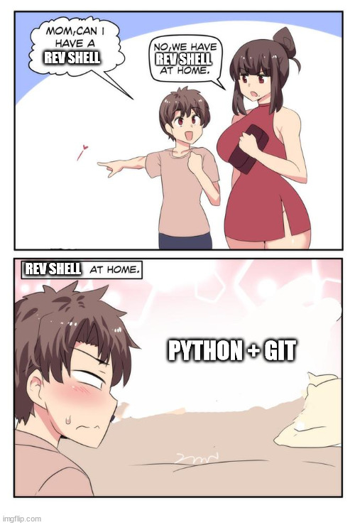

# Weaponizing Open Source

Often, the risks and complexities of running unvetted code - especially in the open-source world - are overlooked or underestimated. This research highlights the potential consequences of blindly integrating external code into your system, emphasizing the importance of Supply Chain Security.

> **Scenario**: You have a goal. You need to ensure the resources in your development pipelines are being configured according to your policy. You find a GitHub project that does exactly what you need. This project is a fork of the widely used [Checkov](https://github.com/bridgecrewio/checkov) project, which you already use anyway, but adds some useful custom checks.

We explore how the open source tool Checkov, along with Python and Git, can be combined to exfiltrate data covertly. Particularly relevant after the discovery of the [XZ Utils backdoor](https://www.wired.com/story/xz-backdoor-everything-you-need-to-know/). 


**Disclaimer**

Open source is incredible. The contributions from open source developers, who voluntarily maintain widely used projects, provide immense benefits to the community. This post is not intended to detract from the value of their work, but rather to emphasise the importance of understanding the potential risks involved when integrating external code into your system.

## Checkov 101

[*"Checkov is a static code analysis tool for scanning infrastructure as code (IaC) files for misconfigurations that may lead to security or compliance problems. Checkov includes more than 750 predefined policies to check for common misconfiguration issues. Checkov also supports the creation and contribution of custom policies."*](https://www.checkov.io/1.Welcome/What%20is%20Checkov.html)

Checkov is often integrated into build pipelines (in a CI/CD system) and can also be run locally. It is packed as a command line tool that runs a series of checks against the resources targeted by the scan. Example:

Focusing on what happens when we are specifying extra custom checks in Checkov, we can either:

1. Specify a directory with the extra checks' code:
```
 checkov --directory *path/to/resources* --external-checks-dir *path/to/custom/checks*
```

2. Specify a Git repo that contains the extra checks' code.
```
checkov --directory *path/to/resources* --external-checks-git *customchecks_giturl*
```

Whichever the way chosen, Checkov checks are really just running code, and Python-based custom checks, are really just running custom Python code.

> Going back to the original scenario. You are almost achieving your goal of ensuring that all your resources are configured according to custom checks, and this is enabled by the (free!) custom extra checks you found. Great win. **What can go wrong?**

## Data Exfiltration with Python and Git

When running Checkov checks (custom or not), you are running code, in your environment, with all the permissions the user runinng it has. This is a great foothold into your environment.

* We have (almost arbitrary) command execution with Python
* We can leverage tools such as Git to in/exfiltrate data

To illustrate this, we have exploit code for:

* A proof of concept [**CKV_COOL_MALI_CHECK**](https://github.com/ytimyno/pac-on-rails/blob/main/checks/malicious/CoolMali.py) that creates a user, generates files, runs bash commands, and installs an OpenSSH server on the machine running Checkov. This allows remote connections using the new user. While this requires sudo privileges and firewall rules might complicate access, the potential for misuse is significant, especially regarding filesystem integrity.

* A proof of concept [**CKV_COOL_MALI_2_CHECK**](https://github.com/ytimyno/pac-on-rails/blob/main/checks/malicious/CoolMali2.py) to silently exfiltrate data with Python and Git:

1. Clones a remote repository (git clone)
2. Creates a new branch* (git checkout)
3. Creates a file with data about the system in the cloned repo directory (keep it simple for PoC, endless opportunities)
4. Commits file to the .git tree (git add & commit)
5. Pushes to the Git repo (git push)
6. Deletes traces of its activity (shutil.rmtree)



## Conclusion

The sky is the limit here. With or without root privileges, you can leave a mark. My advice is **not to run extra checks unless the code has been reviewed and tested by yourself** (you do have to do the work, the "it's fine, open source means it's safe because everyone can check it" solution has been proven *NOT to work*).

This caution applies to any tool where the source code has not been scrutinized. It's not just Checkov, nor is it just Checkov custom checks.


### Actions

- Reached out to Palo Alto through their [security reports page](https://security.paloaltonetworks.com/report).

- Checkov documentation has been updated.


## Related Work & Stories

This research was triggered when developing custom policies to help with metadata guardrails for container images and CSP infrastructure (labels, tags, annotations, etc). Metadata becomes more complex than expected when you consider the semantics used by different providers, the asset types and the lack of maturity of tools in this space. A starter-for-ten is available on [pac-on-rails](https://github.com/ytimyno/pac-on-rails).


